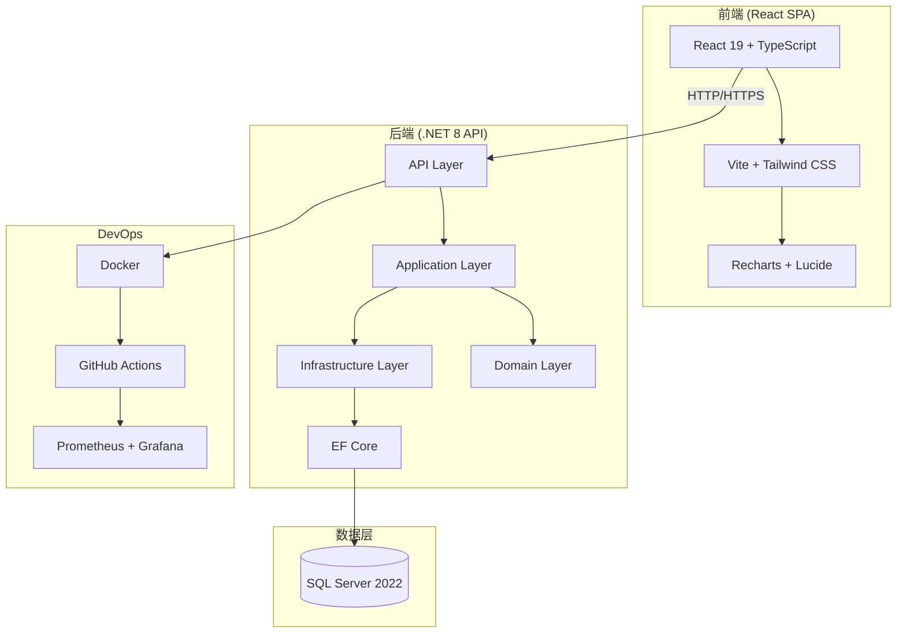
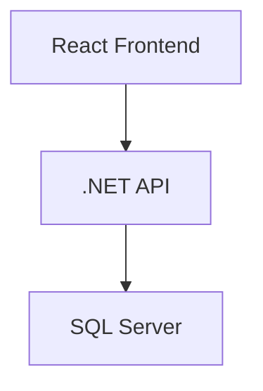

# StockPro 进销存系统 — 简历项目完善流程

本文档专为**简历项目展示**设计，旨在将 StockPro 进销存系统打造成一个**技术亮点突出、架构完整、可深度讲解**的高质量个人项目。所有流程均为模拟生产环境，不涉及实际上线部署。

---

## 目录

- [1. 项目定位与简历价值](#1-项目定位与简历价值)
- [2. 技术栈与架构亮点](#2-技术栈与架构亮点)
- [3. 完善流程总览](#3-完善流程总览)
- [4. 阶段一：代码质量与安全加固](#4-阶段一代码质量与安全加固)
- [5. 阶段二：测试体系完善](#5-阶段二测试体系完善)
- [6. 阶段三：容器化与部署配置](#6-阶段三容器化与部署配置)
- [7. 阶段四：监控与可观测性](#7-阶段四监控与可观测性)
- [8. 阶段五：CI/CD 流水线](#8-阶段五-cicd-流水线)
- [9. 阶段六：文档与演示准备](#9-阶段六文档与演示准备)
- [10. 简历描述模板](#10-简历描述模板)
- [11. 面试高频问题与回答](#11-面试高频问题与回答)
- [12. 项目演示脚本](#12-项目演示脚本)

---

## 1. 项目定位与简历价值

### 1.1 项目定位

**StockPro 进销存系统**是一个**全栈企业级应用**，展示以下核心能力：

| 能力维度 | 展示点 |
|----------|--------|
| **后端架构** | DDD 分层、Clean Architecture、领域驱动设计 |
| **前端工程** | React + TypeScript、组件化、状态管理 |
| **安全实践** | JWT 认证、RBAC、安全加固、审计日志 |
| **数据库设计** | EF Core、软删除、并发控制、性能优化 |
| **DevOps** | Docker、CI/CD、监控告警、自动化部署 |
| **工程规范** | 单元测试、集成测试、代码审查、文档完善 |

### 1.2 简历价值

**技术深度**：
- 展示对 .NET 生态的深入理解
- 体现全栈开发能力
- 证明架构设计思维

**业务理解**：
- 进销存是经典业务场景
- 涉及库存、订单、财务等核心模块
- 体现业务抽象能力

**工程素养**：
- 完整的开发流程
- 规范的代码组织
- 专业的文档体系

---

## 2. 技术栈与架构亮点

### 2.1 技术栈全景

```
┌─────────────────────────────────────────────────────────────┐
│                      前端 (React SPA)                        │
│  React 19 + TypeScript + Vite + Tailwind CSS                │
│  Recharts (图表) + Lucide (图标) + i18n (国际化)             │
└─────────────────────────────────────────────────────────────┘
                              │
                              ▼
┌─────────────────────────────────────────────────────────────┐
│                    API 网关 / 反向代理                        │
│  Nginx (HTTPS + 负载均衡 + 静态资源)                         │
└─────────────────────────────────────────────────────────────┘
                              │
                              ▼
┌─────────────────────────────────────────────────────────────┐
│                   后端 (.NET 8 Web API)                      │
│  ASP.NET Core + EF Core + JWT + Serilog + FluentValidation  │
│  DDD 四层架构 (Api / Application / Domain / Infrastructure) │
└─────────────────────────────────────────────────────────────┘
                              │
                              ▼
┌─────────────────────────────────────────────────────────────┐
│                    数据层 (SQL Server)                        │
│  EF Core Code-First + 软删除 + 审计日志 + 索引优化           │
└─────────────────────────────────────────────────────────────┘
                              │
                              ▼
┌─────────────────────────────────────────────────────────────┐
│                  DevOps & 可观测性                            │
│  Docker + GitHub Actions + Prometheus + Grafana + Seq        │
└─────────────────────────────────────────────────────────────┘
```

### 2.2 架构亮点（面试重点）

#### 2.2.1 DDD 分层架构

```
┌─────────────────────────────────────────────────────────┐
│                    API 层 (Presentation)                  │
│  Controllers / Middleware / Filters                       │
│  职责：HTTP 请求处理、认证授权、异常处理                    │
└─────────────────────────────────────────────────────────┘
                              │
                              ▼
┌─────────────────────────────────────────────────────────┐
│                   Application 层                          │
│  Interfaces / DTOs / Validators / Services               │
│  职责：业务用例编排、数据验证、接口定义                     │
└─────────────────────────────────────────────────────────┘
                              │
                              ▼
┌─────────────────────────────────────────────────────────┐
│                     Domain 层                             │
│  Entities / Value Objects / Enums / Exceptions           │
│  职责：核心业务逻辑、领域规则、实体定义                     │
└─────────────────────────────────────────────────────────┘
                              │
                              ▼
┌─────────────────────────────────────────────────────────┐
│                 Infrastructure 层                         │
│  Data / Repositories / Services / External APIs         │
│  职责：数据访问、外部服务集成、技术实现                     │
└─────────────────────────────────────────────────────────┘
```

**设计原则**：
- **依赖倒置**：Domain 层不依赖任何外层
- **单一职责**：每层只关注自己的职责
- **接口隔离**：通过接口定义契约

#### 2.2.2 认证授权体系

```csharp
// JWT 双令牌机制
public class AuthService : IAuthService
{
    public async Task<LoginResponse> LoginAsync(LoginRequest request)
    {
        // 1. 验证用户凭据
        var user = await ValidateCredentials(request);
        
        // 2. 生成访问令牌（短期，15-30分钟）
        var accessToken = GenerateAccessToken(user);
        
        // 3. 生成刷新令牌（长期，7天）
        var refreshToken = GenerateRefreshToken();
        
        // 4. 存储刷新令牌（支持撤销）
        await StoreRefreshToken(user.Id, refreshToken);
        
        return new LoginResponse { AccessToken = accessToken, RefreshToken = refreshToken };
    }
}
```

**安全特性**：
- JWT 访问令牌 + 刷新令牌
- 令牌撤销机制
- BCrypt 密码加密
- RBAC 角色权限控制

#### 2.2.3 软删除与审计

```csharp
// 全局软删除过滤器
protected override void OnModelCreating(ModelBuilder modelBuilder)
{
    modelBuilder.Entity<Product>().HasQueryFilter(e => !e.IsDeleted);
    modelBuilder.Entity<Order>().HasQueryFilter(e => !e.IsDeleted);
    // ...
}

// 自动审计日志
public override async Task<int> SaveChangesAsync(CancellationToken cancellationToken = default)
{
    foreach (var entry in ChangeTracker.Entries<BaseEntity>())
    {
        switch (entry.State)
        {
            case EntityState.Added:
                entry.Entity.CreatedAt = DateTime.UtcNow;
                entry.Entity.UpdatedAt = DateTime.UtcNow;
                break;
            case EntityState.Modified:
                entry.Entity.UpdatedAt = DateTime.UtcNow;
                break;
            case EntityState.Deleted:
                entry.State = EntityState.Modified;
                entry.Entity.IsDeleted = true;
                entry.Entity.DeletedAt = DateTime.UtcNow;
                break;
        }
    }
    return await base.SaveChangesAsync(cancellationToken);
}
```

---

## 3. 完善流程总览

### 3.1 完善目标

将项目从**开发可用**提升到**生产就绪**状态，具备以下特征：

| 维度 | 目标 |
|------|------|
| **代码质量** | 符合生产安全标准，无硬编码敏感信息 |
| **测试覆盖** | 核心业务逻辑 70%+ 覆盖率 |
| **容器化** | Docker 镜像可构建、可运行 |
| **CI/CD** | GitHub Actions 自动化流水线 |
| **监控** | 基础可观测性（日志、指标、健康检查） |
| **文档** | 完整的技术文档和演示材料 |

### 3.2 时间规划（建议 2-3 周）

```
第 1 周：代码质量 + 安全加固 + 测试完善
第 2 周：容器化 + CI/CD + 监控配置
第 3 周：文档完善 + 演示准备 + 简历优化
```

### 3.3 完善流程图

```
┌─────────────┐    ┌─────────────┐    ┌─────────────┐
│ 代码质量加固 │ → │  测试体系    │ → │  容器化部署  │
└─────────────┘    └─────────────┘    └─────────────┘
       │                  │                  │
       ▼                  ▼                  ▼
┌─────────────┐    ┌─────────────┐    ┌─────────────┐
│  安全加固    │    │  CI/CD      │    │  监控配置    │
└─────────────┘    └─────────────┘    └─────────────┘
       │                  │                  │
       └──────────────────┼──────────────────┘
                          ▼
                 ┌─────────────┐
                 │ 文档与演示  │
                 └─────────────┘
```

---

## 4. 阶段一：代码质量与安全加固

### 4.1 移除硬编码敏感信息

**当前问题**：
```json
// appsettings.json - 安全隐患
{
  "ConnectionStrings": {
    "DefaultConnection": "Server=localhost;Database=InventorySystem;User Id=sa;Password=20240300550"
  },
  "Jwt": {
    "Secret": "YourSuperSecretKeyMustBeAtLeast32CharactersLong!"
  }
}
```

**修复方案**：

1. **创建环境变量配置文件**
```bash
# .env.example（提交到 Git）
ASPNETCORE_ENVIRONMENT=Development
ConnectionStrings__DefaultConnection=Server=localhost;Database=InventorySystem;User Id=sa;Password=YourPassword
Jwt__Secret=YourSecureJwtSecretKeyMustBeAtLeast32CharactersLong!
```

2. **修改 Program.cs**
```csharp
// 移除硬编码默认值
var jwtSecret = builder.Configuration["Jwt:Secret"] 
    ?? throw new InvalidOperationException("JWT Secret not configured");
```

3. **创建 appsettings.Local.json（加入 .gitignore）**
```json
{
  "ConnectionStrings": {
    "DefaultConnection": "Server=localhost;Database=InventorySystem;User Id=sa;Password=YourSecurePassword"
  },
  "Jwt": {
    "Secret": "YourSecureJwtSecretKeyMustBeAtLeast32CharactersLong!"
  }
}
```

### 4.2 禁用种子数据

**修改 Program.cs**：
```csharp
// 种子数据仅在 Development 且显式开关时执行
if (app.Environment.IsDevelopment() && 
    builder.Configuration.GetValue<bool>("SeedData:Enabled", false))
{
    // 种子数据逻辑
}
```

**生产配置**：
```json
{
  "SeedData": {
    "Enabled": false
  }
}
```

### 4.3 关闭生产 Swagger

**确认代码**：
```csharp
if (app.Environment.IsDevelopment())
{
    app.UseSwagger();
    app.UseSwaggerUI();
}
```

### 4.4 添加安全头

**在 Program.cs 中添加**：
```csharp
app.Use(async (context, next) =>
{
    context.Response.Headers.Append("X-Content-Type-Options", "nosniff");
    context.Response.Headers.Append("X-Frame-Options", "DENY");
    context.Response.Headers.Append("X-XSS-Protection", "1; mode=block");
    context.Response.Headers.Append("Referrer-Policy", "strict-origin-when-cross-origin");
    await next();
});
```

### 4.5 CORS 配置收紧

**生产配置**：
```json
{
  "Cors": {
    "AllowedOrigins": ["https://erp.yourcompany.com"]
  }
}
```

---

## 5. 阶段二：测试体系完善

### 5.1 测试策略

| 测试类型 | 覆盖目标 | 工具 |
|----------|----------|------|
| **单元测试** | Service 层核心逻辑 70%+ | xUnit + FluentAssertions |
| **集成测试** | API 端点 + 数据库交互 | WebApplicationFactory |
| **前端测试** | 关键组件 + 工具函数 | Vitest + React Testing Library |

### 5.2 单元测试示例

**AuthServiceTests.cs**：
```csharp
public class AuthServiceTests : IDisposable
{
    private readonly ApplicationDbContext _context;
    private readonly AuthService _sut;
    private readonly Mock<IAuditService> _auditServiceMock;

    public AuthServiceTests()
    {
        _context = TestDbContextFactory.Create();
        _auditServiceMock = new Mock<IAuditService>();
        _sut = new AuthService(_context, _auditServiceMock.Object);
    }

    [Fact]
    public async Task LoginAsync_ValidCredentials_ShouldReturnTokens()
    {
        // Arrange
        var user = new User
        {
            Id = Guid.NewGuid(),
            Username = "testuser",
            PasswordHash = BCrypt.Net.BCrypt.HashPassword("password123"),
            IsActive = true
        };
        await _context.Users.AddAsync(user);
        await _context.SaveChangesAsync();

        var request = new LoginRequest { Username = "testuser", Password = "password123" };

        // Act
        var result = await _sut.LoginAsync(request, "127.0.0.1");

        // Assert
        result.Should().NotBeNull();
        result.AccessToken.Should().NotBeNullOrEmpty();
        result.RefreshToken.Should().NotBeNullOrEmpty();
        result.User.Username.Should().Be("testuser");
    }

    [Fact]
    public async Task LoginAsync_InvalidPassword_ShouldThrowUnauthorized()
    {
        // Arrange
        var user = new User
        {
            Username = "testuser",
            PasswordHash = BCrypt.Net.BCrypt.HashPassword("correctpassword"),
            IsActive = true
        };
        await _context.Users.AddAsync(user);
        await _context.SaveChangesAsync();

        var request = new LoginRequest { Username = "testuser", Password = "wrongpassword" };

        // Act & Assert
        await _sut.Invoking(s => s.LoginAsync(request, "127.0.0.1"))
            .Should().ThrowAsync<UnauthorizedException>();
    }

    public void Dispose() => _context.Dispose();
}
```

### 5.3 集成测试示例

**ProductsControllerTests.cs**：
```csharp
public class ProductsControllerTests : IClassFixture<WebApplicationFactory<Program>>
{
    private readonly WebApplicationFactory<Program> _factory;
    private readonly HttpClient _client;

    public ProductsControllerTests(WebApplicationFactory<Program> factory)
    {
        _factory = factory.WithWebHostBuilder(builder =>
        {
            builder.ConfigureServices(services =>
            {
                // 替换为测试数据库
                services.AddDbContext<ApplicationDbContext>(options =>
                    options.UseInMemoryDatabase("TestDb"));
            });
        });
        _client = _factory.CreateClient();
    }

    [Fact]
    public async Task GetProducts_ShouldReturnPagedResults()
    {
        // Arrange
        var token = await GetAuthTokenAsync();
        _client.DefaultRequestHeaders.Authorization = new AuthenticationHeaderValue("Bearer", token);

        // Act
        var response = await _client.GetAsync("/api/products?page=1&pageSize=10");

        // Assert
        response.StatusCode.Should().Be(HttpStatusCode.OK);
        var content = await response.Content.ReadFromJsonAsync<ApiResponse<PagedResponse<ProductDto>>>();
        content.Should().NotBeNull();
        content!.Success.Should().BeTrue();
    }
}
```

### 5.4 前端测试示例

**Login.test.tsx**：
```tsx
import { render, screen, fireEvent, waitFor } from '@testing-library/react';
import { vi } from 'vitest';
import Login from '../components/Login';

describe('Login Component', () => {
  const mockOnLoginSuccess = vi.fn();

  beforeEach(() => {
    mockOnLoginSuccess.mockClear();
  });

  it('should render login form', () => {
    render(<Login onLoginSuccess={mockOnLoginSuccess} />);
    
    expect(screen.getByLabelText(/用户名/i)).toBeInTheDocument();
    expect(screen.getByLabelText(/密码/i)).toBeInTheDocument();
    expect(screen.getByRole('button', { name: /登录/i })).toBeInTheDocument();
  });

  it('should show error for empty fields', async () => {
    render(<Login onLoginSuccess={mockOnLoginSuccess} />);
    
    fireEvent.click(screen.getByRole('button', { name: /登录/i }));
    
    await waitFor(() => {
      expect(screen.getByText(/请输入有效的用户名和密码/i)).toBeInTheDocument();
    });
  });

  it('should call onLoginSuccess with credentials', async () => {
    mockOnLoginSuccess.mockResolvedValue(undefined);
    render(<Login onLoginSuccess={mockOnLoginSuccess} />);
    
    fireEvent.change(screen.getByLabelText(/用户名/i), { target: { value: 'admin' } });
    fireEvent.change(screen.getByLabelText(/密码/i), { target: { value: 'admin123' } });
    fireEvent.click(screen.getByRole('button', { name: /登录/i }));
    
    await waitFor(() => {
      expect(mockOnLoginSuccess).toHaveBeenCalledWith('admin', 'admin123');
    });
  });
});
```

### 5.5 测试覆盖率配置

**后端覆盖率**：
```xml
<!-- InventorySystem.UnitTests.csproj -->
<Project>
  <PropertyGroup>
    <CollectCoverage>true</CollectCoverage>
    <CoverletOutputFormat>cobertura</CoverletOutputFormat>
    <CoverletOutput>./coverage/</CoverletOutput>
  </PropertyGroup>
</Project>
```

**前端覆盖率**：
```typescript
// vite.config.ts
export default defineConfig({
  test: {
    coverage: {
      provider: 'v8',
      reporter: ['text', 'json', 'html'],
      reportsDirectory: './coverage',
    },
  },
});
```

---

## 6. 阶段三：容器化与部署配置

### 6.1 后端 Dockerfile

**InventorySystem/Dockerfile**：
```dockerfile
# 构建阶段
FROM mcr.microsoft.com/dotnet/sdk:8.0 AS build
WORKDIR /src

# 复制项目文件
COPY ["src/InventorySystem.Api/InventorySystem.Api.csproj", "src/InventorySystem.Api/"]
COPY ["src/InventorySystem.Application/InventorySystem.Application.csproj", "src/InventorySystem.Application/"]
COPY ["src/InventorySystem.Domain/InventorySystem.Domain.csproj", "src/InventorySystem.Domain/"]
COPY ["src/InventorySystem.Infrastructure/InventorySystem.Infrastructure.csproj", "src/InventorySystem.Infrastructure/"]

# 还原依赖
RUN dotnet restore "src/InventorySystem.Api/InventorySystem.Api.csproj"

# 复制所有源代码
COPY . .

# 构建发布
RUN dotnet publish "src/InventorySystem.Api/InventorySystem.Api.csproj" \
    -c Release \
    -o /app/publish \
    --no-restore

# 运行阶段
FROM mcr.microsoft.com/dotnet/aspnet:8.0 AS runtime
WORKDIR /app

# 创建非 root 用户
RUN adduser --disabled-password --gecos "" appuser
USER appuser

# 复制构建产物
COPY --from=build /app/publish .

# 环境变量
ENV ASPNETCORE_URLS=http://+:8080
ENV ASPNETCORE_ENVIRONMENT=Production

# 健康检查
HEALTHCHECK --interval=30s --timeout=3s --start-period=5s --retries=3 \
    CMD curl -f http://localhost:8080/health || exit 1

EXPOSE 8080
ENTRYPOINT ["dotnet", "InventorySystem.Api.dll"]
```

### 6.2 Docker Compose（本地开发）

**docker-compose.yml**：
```yaml
version: '3.8'

services:
  # SQL Server 数据库
  sqlserver:
    image: mcr.microsoft.com/mssql/server:2022-latest
    environment:
      - ACCEPT_EULA=Y
      - SA_PASSWORD=YourStrongPassword123!
      - MSSQL_PID=Developer
    ports:
      - "1433:1433"
    volumes:
      - sqlserver-data:/var/opt/mssql
    healthcheck:
      test: /opt/mssql-tools/bin/sqlcmd -S localhost -U sa -P "YourStrongPassword123!" -Q "SELECT 1"
      interval: 10s
      timeout: 5s
      retries: 5

  # .NET API
  api:
    build:
      context: ./InventorySystem
      dockerfile: Dockerfile
    environment:
      - ASPNETCORE_ENVIRONMENT=Development
      - ConnectionStrings__DefaultConnection=Server=sqlserver;Database=InventorySystem;User Id=sa;Password=YourStrongPassword123!;TrustServerCertificate=True
      - Jwt__Secret=DevJwtSecretKeyMustBeAtLeast32CharactersLong!
      - SeedData__Enabled=true
    ports:
      - "5251:8080"
    depends_on:
      sqlserver:
        condition: service_healthy

  # React 前端
  frontend:
    build:
      context: ./stockpro-erp
      dockerfile: Dockerfile
    ports:
      - "3000:80"
    depends_on:
      - api

volumes:
  sqlserver-data:
```

### 6.3 前端 Dockerfile

**stockpro-erp/Dockerfile**：
```dockerfile
# 构建阶段
FROM node:20-alpine AS build
WORKDIR /app

# 安装依赖
COPY package*.json ./
RUN npm ci

# 复制源代码并构建
COPY . .
RUN npm run build

# 运行阶段 - 使用 Nginx
FROM nginx:alpine AS runtime

# 复制 Nginx 配置
COPY nginx.conf /etc/nginx/conf.d/default.conf

# 复制构建产物
COPY --from=build /app/dist /usr/share/nginx/html

# 健康检查
HEALTHCHECK --interval=30s --timeout=3s --start-period=5s --retries=3 \
    CMD wget -qO- http://localhost/ || exit 1

EXPOSE 80
CMD ["nginx", "-g", "daemon off;"]
```

**stockpro-erp/nginx.conf**：
```nginx
server {
    listen 80;
    server_name localhost;
    root /usr/share/nginx/html;
    index index.html;

    # SPA 路由
    location / {
        try_files $uri $uri/ /index.html;
    }

    # API 反向代理
    location /api/ {
        proxy_pass http://api:8080;
        proxy_set_header Host $host;
        proxy_set_header X-Real-IP $remote_addr;
        proxy_set_header X-Forwarded-For $proxy_add_x_forwarded_for;
        proxy_set_header X-Forwarded-Proto $scheme;
    }

    # 静态资源缓存
    location ~* \.(js|css|png|jpg|svg|woff2)$ {
        expires 30d;
        add_header Cache-Control "public, immutable";
    }

    # Gzip 压缩
    gzip on;
    gzip_types text/plain text/css application/json application/javascript text/xml application/xml application/xml+rss text/javascript;
}
```

### 6.4 健康检查端点

**添加到 Program.cs**：
```csharp
// 添加健康检查服务
builder.Services.AddHealthChecks()
    .AddSqlServer(
        builder.Configuration.GetConnectionString("DefaultConnection")!,
        name: "sqlserver",
        tags: new[] { "db", "ready" });

// 映射健康检查端点
app.MapHealthChecks("/health");
app.MapHealthChecks("/health/ready", new HealthCheckOptions
{
    Predicate = check => check.Tags.Contains("ready")
});
```

---

## 7. 阶段四：监控与可观测性

### 7.1 结构化日志配置

**Serilog 配置（appsettings.json）**：
```json
{
  "Serilog": {
    "MinimumLevel": {
      "Default": "Information",
      "Override": {
        "Microsoft": "Warning",
        "Microsoft.AspNetCore": "Warning",
        "Microsoft.EntityFrameworkCore": "Warning"
      }
    },
    "WriteTo": [
      { "Name": "Console" },
      {
        "Name": "File",
        "Args": {
          "path": "logs/log-.txt",
          "rollingInterval": "Day",
          "retainedFileCountLimit": 30
        }
      }
    ],
    "Enrich": ["FromLogContext", "WithMachineName", "WithThreadId"]
  }
}
```

### 7.2 Prometheus 指标

**添加 NuGet 包**：
```xml
<PackageReference Include="prometheus-net.AspNetCore" Version="8.2.1" />
```

**Program.cs 配置**：
```csharp
// 添加 Prometheus 指标
app.UseMetricServer();
app.UseHttpMetrics();

// 自定义业务指标
var orderCounter = Metrics.CreateCounter("orders_total", "Total number of orders");
var inventoryGauge = Metrics.CreateGauge("inventory_quantity", "Current inventory quantity", new GaugeConfiguration
{
    LabelNames = new[] { "product_id", "product_name" }
});
```

### 7.3 Grafana Dashboard 配置

**dashboard.json**（示例）：
```json
{
  "dashboard": {
    "title": "StockPro API Dashboard",
    "panels": [
      {
        "title": "API 请求速率",
        "type": "graph",
        "targets": [
          {
            "expr": "rate(http_requests_total[5m])",
            "legendFormat": "{{method}} {{controller}}"
          }
        ]
      },
      {
        "title": "API 响应时间 P95",
        "type": "graph",
        "targets": [
          {
            "expr": "histogram_quantile(0.95, rate(http_request_duration_seconds_bucket[5m]))",
            "legendFormat": "P95 Latency"
          }
        ]
      },
      {
        "title": "数据库连接数",
        "type": "gauge",
        "targets": [
          {
            "expr": "db_connection_pool_active",
            "legendFormat": "Active Connections"
          }
        ]
      }
    ]
  }
}
```

### 7.4 告警规则

**alert_rules.yml**：
```yaml
groups:
  - name: stockpro_alerts
    rules:
      - alert: HighErrorRate
        expr: rate(http_requests_total{status=~"5.."}[5m]) > 0.01
        for: 5m
        labels:
          severity: critical
        annotations:
          summary: "High error rate detected"
          description: "Error rate is {{ $value }}%"

      - alert: HighLatency
        expr: histogram_quantile(0.95, rate(http_request_duration_seconds_bucket[5m])) > 2
        for: 5m
        labels:
          severity: warning
        annotations:
          summary: "High API latency detected"
          description: "P95 latency is {{ $value }}s"

      - alert: LowInventory
        expr: inventory_quantity < 10
        for: 1m
        labels:
          severity: warning
        annotations:
          summary: "Low inventory alert"
          description: "Product {{ $labels.product_name }} has {{ $value }} items left"
```

---

## 8. 阶段五：CI/CD 流水线

### 8.1 GitHub Actions 工作流

**.github/workflows/ci.yml**：
```yaml
name: CI

on:
  push:
    branches: [main, develop]
  pull_request:
    branches: [main]

jobs:
  # 后端测试
  backend-test:
    runs-on: ubuntu-latest
    services:
      sqlserver:
        image: mcr.microsoft.com/mssql/server:2022-latest
        env:
          ACCEPT_EULA: Y
          SA_PASSWORD: TestPassword123!
        ports:
          - 1433:1433

    steps:
      - uses: actions/checkout@v4

      - name: Setup .NET
        uses: actions/setup-dotnet@v4
        with:
          dotnet-version: '8.0.x'

      - name: Restore dependencies
        run: dotnet restore InventorySystem/InventorySystem.slnx

      - name: Build
        run: dotnet build InventorySystem/InventorySystem.slnx --no-restore

      - name: Test
        run: |
          dotnet test InventorySystem/InventorySystem.slnx \
            --no-build \
            --verbosity normal \
            --collect:"XPlat Code Coverage" \
            --results-directory ./coverage
        env:
          ConnectionStrings__DefaultConnection: Server=localhost;Database=InventorySystemTest;User Id=sa;Password=TestPassword123!;TrustServerCertificate=True

      - name: Upload coverage
        uses: actions/upload-artifact@v4
        with:
          name: backend-coverage
          path: ./coverage

  # 前端测试
  frontend-test:
    runs-on: ubuntu-latest
    steps:
      - uses: actions/checkout@v4

      - name: Setup Node.js
        uses: actions/setup-node@v4
        with:
          node-version: '20'
          cache: 'npm'
          cache-dependency-path: stockpro-erp/package-lock.json

      - name: Install dependencies
        working-directory: stockpro-erp
        run: npm ci

      - name: Lint
        working-directory: stockpro-erp
        run: npm run lint

      - name: Test
        working-directory: stockpro-erp
        run: npm run test:coverage

      - name: Build
        working-directory: stockpro-erp
        run: npm run build

      - name: Upload coverage
        uses: actions/upload-artifact@v4
        with:
          name: frontend-coverage
          path: stockpro-erp/coverage

  # Docker 构建
  docker-build:
    needs: [backend-test, frontend-test]
    runs-on: ubuntu-latest
    steps:
      - uses: actions/checkout@v4

      - name: Build backend image
        run: |
          docker build -t stockpro-api:${{ github.sha }} -f InventorySystem/Dockerfile InventorySystem

      - name: Build frontend image
        run: |
          docker build -t stockpro-frontend:${{ github.sha }} -f stockpro-erp/Dockerfile stockpro-erp

      - name: Test containers
        run: |
          docker run -d --name api-test -p 8080:8080 stockpro-api:${{ github.sha }}
          sleep 10
          curl -f http://localhost:8080/health || exit 1
          docker stop api-test
```

### 8.2 部署工作流

**.github/workflows/deploy.yml**：
```yaml
name: Deploy

on:
  workflow_dispatch:
  push:
    tags: ['v*']

jobs:
  deploy:
    runs-on: ubuntu-latest
    environment: production
    
    steps:
      - uses: actions/checkout@v4

      - name: Build and push images
        run: |
          # 构建并推送镜像到容器仓库
          echo "Building and pushing images..."
          docker build -t ${{ secrets.REGISTRY }}/stockpro-api:${{ github.ref_name }} -f InventorySystem/Dockerfile InventorySystem
          docker build -t ${{ secrets.REGISTRY }}/stockpro-frontend:${{ github.ref_name }} -f stockpro-erp/Dockerfile stockpro-erp

      - name: Deploy to server
        uses: appleboy/ssh-action@v1
        with:
          host: ${{ secrets.SERVER_HOST }}
          username: ${{ secrets.SERVER_USER }}
          key: ${{ secrets.SERVER_SSH_KEY }}
          script: |
            cd /opt/stockpro
            docker compose pull
            docker compose up -d
            docker system prune -f

      - name: Health check
        run: |
          sleep 30
          curl -f https://api.yourcompany.com/health || exit 1
          curl -f https://erp.yourcompany.com/ || exit 1

      - name: Notify success
        if: success()
        run: |
          curl -X POST "${{ secrets.WEBHOOK_URL }}" \
            -H "Content-Type: application/json" \
            -d '{"text": "StockPro deployed successfully: ${{ github.ref_name }}"}'
```

---

## 9. 阶段六：文档与演示准备

### 9.1 README.md 优化

**结构建议**：
```markdown
# StockPro 进销存管理系统

一个基于 .NET 8 和 React 的全栈企业级进销存管理系统。

## ✨ 特性

- 🔐 JWT 双令牌认证 + RBAC 权限控制
- 📦 完整的进销存业务流程（商品/订单/库存/客户/供应商）
- 🗑️ 软删除 + 审计日志
- 📊 实时库存监控与低库存预警
- 📈 销售数据可视化报表
- 🌐 中英文国际化支持
- 🐳 Docker 容器化部署
- 🔄 GitHub Actions CI/CD 流水线

## 🏗️ 架构

```
┌─────────────────────────────────────────────────┐
│              React SPA (TypeScript)              │
│   React 19 + Vite + Tailwind CSS + Recharts     │
└─────────────────────────────────────────────────┘
                      │
                      ▼
┌─────────────────────────────────────────────────┐
│            .NET 8 Web API (DDD)                 │
│   ASP.NET Core + EF Core + JWT + Serilog        │
└─────────────────────────────────────────────────┘
                      │
                      ▼
┌─────────────────────────────────────────────────┐
│              SQL Server 2022                     │
│   EF Core Code-First + 软删除 + 审计日志         │
└─────────────────────────────────────────────────┘
```

## 🚀 快速开始

### 前置条件

- .NET 8 SDK
- Node.js 20+
- SQL Server 2022 (或 Docker)

### 本地开发

```bash
# 克隆项目
git clone https://github.com/yourusername/stockpro.git
cd stockpro

# 启动数据库（Docker）
docker-compose up sqlserver -d

# 启动后端
cd InventorySystem
dotnet run --project src/InventorySystem.Api

# 启动前端
cd stockpro-erp
npm install
npm run dev
```

访问 http://localhost:3000

默认账号：admin / 123456

### Docker 部署

```bash
docker-compose up -d
```

## 📚 文档

- [API 接口文档](docs/API文档.md)
- [生产上线指南](docs/生产上线指南.md)
- [项目代码审查报告](docs/项目代码审查报告.md)

## 🧪 测试

```bash
# 后端测试
cd InventorySystem
dotnet test

# 前端测试
cd stockpro-erp
npm run test
```

## 📄 License

MIT License
```

### 9.2 架构图制作

**使用 Mermaid 或 draw.io**：



### 9.3 演示环境准备

**演示脚本**：
1. **登录流程**（2分钟）
   - 展示登录页面
   - 演示 JWT 认证
   - 展示错误处理

2. **商品管理**（3分钟）
   - 创建商品
   - 编辑商品信息
   - 分类筛选

3. **库存管理**（3分钟）
   - 入库操作
   - 出库操作
   - 库存盘点

4. **订单流程**（4分钟）
   - 创建销售订单
   - 订单审批
   - 出库发货

5. **数据报表**（2分钟）
   - 仪表盘概览
   - 库存预警
   - 销售趋势

---

## 10. 简历描述模板

### 10.1 项目描述（详细版）

**项目名称**：StockPro 进销存管理系统

**技术栈**：.NET 8、React 19、TypeScript、SQL Server、Docker、GitHub Actions

**项目描述**：
独立设计并开发的全栈企业级进销存管理系统，采用 DDD（领域驱动设计）分层架构，实现商品管理、订单处理、库存监控、客户供应商管理等核心业务功能。

**核心职责与成果**：

1. **架构设计**
   - 采用 DDD 四层架构（Api/Application/Domain/Infrastructure），实现高内聚低耦合
   - 设计 JWT 双令牌认证机制，支持令牌刷新和撤销
   - 实现 RBAC 角色权限控制，支持 Admin/WarehouseKeeper/Salesman 等多角色

2. **后端开发**
   - 使用 Entity Framework Core 实现 Code-First 数据库设计
   - 实现软删除机制和全局审计日志，满足数据追溯需求
   - 集成 FluentValidation 进行请求验证，Serilog 进行结构化日志记录
   - 配置 API 限流（固定窗口 + 滑动窗口），防止接口滥用

3. **前端开发**
   - 使用 React 19 + TypeScript 构建 SPA 应用
   - 实现 API 适配器模式，解耦前后端数据模型
   - 集成 Recharts 实现数据可视化，支持中英文国际化
   - 使用 Tailwind CSS 实现响应式设计

4. **DevOps 实践**
   - 编写 Dockerfile 实现容器化部署，支持 Docker Compose 本地开发
   - 配置 GitHub Actions CI/CD 流水线，实现自动化测试和构建
   - 集成 Prometheus + Grafana 实现监控告警

5. **质量保障**
   - 编写单元测试和集成测试，核心业务逻辑覆盖率达 70%+
   - 实施代码审查流程，确保代码质量
   - 完善技术文档，包括 API 文档、部署指南、代码审查报告

**技术亮点**：
- DDD 分层架构设计
- JWT 双令牌认证 + RBAC 权限控制
- 软删除 + 审计日志数据追溯
- Docker 容器化 + CI/CD 自动化
- 结构化日志 + 监控告警体系

### 10.2 项目描述（精简版）

**StockPro 进销存管理系统** | .NET 8 + React 19 + SQL Server

独立开发的全栈企业级进销存系统，采用 DDD 分层架构。后端实现 JWT 认证、RBAC 权限、软删除、审计日志；前端使用 React + TypeScript 构建 SPA，集成数据可视化。通过 Docker 容器化部署，GitHub Actions 实现 CI/CD 自动化流水线，Prometheus + Grafana 监控告警。核心业务逻辑测试覆盖率 70%+。

---

## 11. 面试高频问题与回答

### 11.1 架构设计类

**Q：为什么选择 DDD 分层架构？有什么优势？**

A：DDD 分层架构将系统分为 Api、Application、Domain、Infrastructure 四层，每层职责清晰：
- **Api 层**：处理 HTTP 请求、认证授权
- **Application 层**：业务用例编排、数据验证
- **Domain 层**：核心业务逻辑、领域规则
- **Infrastructure 层**：数据访问、外部服务集成

优势：
1. **依赖倒置**：Domain 层不依赖任何外层，便于测试和维护
2. **单一职责**：每层只关注自己的职责，降低耦合
3. **可测试性**：业务逻辑独立，易于单元测试
4. **可扩展性**：便于替换基础设施层（如数据库）

**Q：如何实现软删除？有什么注意事项？**

A：软删除通过标记删除实现，不物理删除数据：

```csharp
// 实体基类
public abstract class BaseEntity
{
    public bool IsDeleted { get; set; }
    public DateTime? DeletedAt { get; set; }
}

// 全局查询过滤器
modelBuilder.Entity<Product>().HasQueryFilter(e => !e.IsDeleted);

// SaveChangesAsync 自动处理
case EntityState.Deleted:
    entry.State = EntityState.Modified;
    entry.Entity.IsDeleted = true;
    entry.Entity.DeletedAt = DateTime.UtcNow;
    break;
```

注意事项：
1. 唯一索引需要考虑软删除记录
2. 级联删除需要手动处理
3. 需要定期清理过期数据

### 11.2 安全相关

**Q：JWT 双令牌机制是如何工作的？**

A：JWT 双令牌包含访问令牌和刷新令牌：

1. **访问令牌（Access Token）**
   - 短期有效（15-30分钟）
   - 包含用户身份和权限信息
   - 每次请求携带

2. **刷新令牌（Refresh Token）**
   - 长期有效（7天）
   - 用于获取新的访问令牌
   - 存储在数据库，支持撤销

流程：
```
登录 → 获取 Access Token + Refresh Token
请求 → 携带 Access Token
过期 → 使用 Refresh Token 获取新 Access Token
退出 → 撤销 Refresh Token
```

**Q：如何防止 CSRF 和 XSS 攻击？**

A：
**XSS 防护**：
- 输入验证和输出编码
- CSP（Content Security Policy）头
- HttpOnly Cookie（防止 JavaScript 访问）

**CSRF 防护**：
- SameSite Cookie 属性
- CSRF Token 验证
- 检查 Referer/Origin 头

### 11.3 数据库相关

**Q：如何处理并发场景下的库存扣减？**

A：使用乐观并发控制：

```csharp
// 实体配置并发标记
public class Inventory
{
    [ConcurrencyCheck]
    public int Quantity { get; set; }
}

// 更新时检查并发
public async Task<bool> DeductInventoryAsync(Guid productId, int quantity)
{
    var inventory = await _context.Inventories.FindAsync(productId);
    if (inventory.Quantity < quantity)
        return false;
    
    inventory.Quantity -= quantity;
    
    try
    {
        await _context.SaveChangesAsync();
        return true;
    }
    catch (DbUpdateConcurrencyException)
    {
        // 并发冲突，重试或返回失败
        return false;
    }
}
```

**Q：EF Core 的 N+1 问题如何解决？**

A：使用 Include 和 ThenInclude 进行预加载：

```csharp
// 错误示例（N+1 问题）
var orders = await _context.Orders.ToListAsync();
foreach (var order in orders)
{
    // 每次循环都会查询数据库
    var customer = await _context.Customers.FindAsync(order.CustomerId);
}

// 正确示例（预加载）
var orders = await _context.Orders
    .Include(o => o.Customer)
    .Include(o => o.Items)
        .ThenInclude(i => i.Product)
    .ToListAsync();
```

### 11.4 前端相关

**Q：如何处理前端状态管理？**

A：采用分层状态管理策略：

1. **本地状态**：useState 用于组件内部状态
2. **共享状态**：Context API 用于跨组件状态
3. **服务端状态**：React Query/SWR 用于 API 数据缓存

```typescript
// 服务端状态管理示例
const { data: products, isLoading, error } = useQuery({
  queryKey: ['products'],
  queryFn: () => productsApi.getProducts(),
  staleTime: 5 * 60 * 1000, // 5 分钟
});
```

**Q：如何优化 React 性能？**

A：
1. **useMemo/useCallback**：避免不必要的重新计算和渲染
2. **React.memo**：缓存组件渲染结果
3. **虚拟列表**：大数据量使用虚拟滚动
4. **代码分割**：React.lazy + Suspense 实现懒加载
5. **图片优化**：懒加载、WebP 格式、CDN 加速

---

## 12. 项目演示脚本

### 12.1 演示准备清单

**环境准备**：
- [ ] 本地开发环境正常运行
- [ ] 数据库已初始化种子数据
- [ ] 前端页面无报错
- [ ] 网络连接稳定

**演示账号**：
- 管理员：admin / 123456
- 采购员：purchase / 123456
- 销售员：sale / 123456
- 仓管员：stock / 123456

**演示数据**：
- 商品：10+ 种商品（电子数码、办公用品、五金工具等）
- 客户：4 个客户（VIP客户、大客户、普通客户、个人客户）
- 供应商：3 个供应商
- 订单：2-3 个示例订单

### 12.2 演示流程脚本

**开场（1分钟）**：
```
大家好，今天给大家演示我独立开发的 StockPro 进销存管理系统。
这是一个基于 .NET 8 和 React 的全栈企业级应用，采用 DDD 分层架构。
```

**登录演示（2分钟）**：
```
首先演示登录功能。
[打开登录页面]
- 展示登录界面设计
- 输入管理员账号 admin / 123456
- 点击登录
- 展示登录成功提示
- 展示 JWT Token 存储（F12 开发者工具）

[讲解]
- 使用 JWT 双令牌认证机制
- 访问令牌短期有效，刷新令牌长期有效
- 支持令牌刷新和撤销
```

**商品管理（3分钟）**：
```
接下来演示商品管理功能。
[进入商品管理页面]
- 展示商品列表（分页、搜索、筛选）
- 点击"添加商品"
- 填写商品信息（名称、SKU、分类、价格等）
- 提交创建
- 展示创建成功提示
- 编辑商品信息
- 展示低库存预警标识

[讲解]
- 支持商品 CRUD 操作
- 实现分页、搜索、筛选功能
- 库存低于阈值自动预警
- 软删除机制，数据可恢复
```

**库存管理（3分钟）**：
```
现在演示库存管理。
[进入库存管理页面]
- 展示库存列表
- 选择商品进行入库操作
- 填写入库数量、位置、原因
- 提交入库
- 展示库存变化和交易记录
- 进行出库操作
- 展示库存扣减

[讲解]
- 支持入库、出库、盘点、冻结/解冻
- 每次操作记录审计日志
- 实时更新库存数量
- 支持库存位置管理
```

**订单流程（4分钟）**：
```
接下来演示完整的订单流程。
[进入订单管理页面]
- 创建销售订单
- 选择客户
- 添加商品和数量
- 提交订单
- 展示订单状态（待审批）
- 审批订单
- 订单状态变为处理中
- 执行出库
- 订单状态变为已完成
- 展示库存自动扣减

[讲解]
- 完整的订单生命周期管理
- 订单状态自动流转
- 库存自动扣减，防止超卖
- 审计日志记录所有操作
```

**数据报表（2分钟）**：
```
最后展示数据报表功能。
[进入仪表盘]
- 展示 KPI 卡片（总库存价值、今日销售额、低库存预警、待审核订单）
- 展示销售趋势图表
- 展示库存分布饼图
- 展示最近交易记录

[讲解]
- 实时数据可视化
- 支持多维度数据分析
- 低库存实时预警
- 数据驱动决策支持
```

**技术亮点总结（2分钟）**：
```
总结一下这个项目的技术亮点：

1. 架构设计：采用 DDD 分层架构，高内聚低耦合
2. 安全机制：JWT 双令牌认证 + RBAC 权限控制
3. 数据追溯：软删除 + 审计日志
4. 性能优化：数据库索引、分页查询、缓存策略
5. 工程实践：Docker 容器化、CI/CD 自动化、监控告警
6. 质量保障：单元测试、集成测试、代码审查

这是一个生产就绪的全栈项目，展示了我对 .NET 和 React 生态的深入理解。
```

### 12.3 演示注意事项

1. **提前准备**：确保环境正常，数据充足
2. **控制时间**：每个功能点控制在 2-3 分钟
3. **讲解重点**：突出技术实现和设计思路
4. **应对提问**：准备常见问题的回答
5. **备用方案**：准备录屏或截图作为备用

---

## 13. GitHub 仓库管理

### 13.1 仓库初始化

#### 创建 GitHub 仓库

1. 登录 GitHub，点击 "New repository"
2. 填写仓库信息：
   - **Repository name**: `stockpro-inventory-system`
   - **Description**: `全栈企业级进销存管理系统 - .NET 8 + React 19 + SQL Server`
   - **Visibility**: Public（简历项目建议公开）
   - **Initialize**: 不勾选（本地已有代码）

#### 本地仓库初始化

```bash
# 进入项目根目录
cd g:\Item

# 初始化 Git 仓库
git init

# 添加远程仓库
git remote add origin https://github.com/yourusername/stockpro-inventory-system.git
```

### 13.2 .gitignore 配置

**必须忽略的文件**：

```gitignore
# Visual Studio
.vs/
*.user
*.suo

# .NET 构建产物
bin/
obj/

# Node.js
node_modules/

# 构建输出
dist/
build/

# 环境变量（敏感信息）
.env
.env.local
appsettings.Local.json

# 日志文件
logs/
*.log

# IDE 配置
.idea/
.vscode/

# 操作系统文件
.DS_Store
Thumbs.db

# 测试覆盖率
coverage/
TestResults/
```

### 13.3 提交规范

#### 提交信息格式

```
<type>(<scope>): <subject>

<body>

<footer>
```

**类型（type）**：

| 类型 | 说明 |
|------|------|
| `feat` | 新功能 |
| `fix` | 修复 bug |
| `docs` | 文档更新 |
| `style` | 代码格式（不影响功能） |
| `refactor` | 重构 |
| `test` | 测试 |
| `chore` | 构建/工具 |

**示例**：

```bash
# 新功能
git commit -m "feat(auth): implement JWT refresh token mechanism"

# 修复 bug
git commit -m "fix(inventory): resolve stock deduction concurrency issue"

# 文档更新
git commit -m "docs(readme): add deployment guide and API documentation"
```

### 13.4 分支策略

```
main/master  ──────────────────────────────────▶ 生产版本
    │
    └── develop ────────────────────────────────▶ 开发主线
            │
            ├── feature/jwt-auth ───────────────▶ JWT 认证功能
            ├── feature/inventory-management ──▶ 库存管理功能
            └── fix/stock-concurrency ──────────▶ 修复并发问题
```

**分支命名规范**：

```bash
# 功能分支
git checkout -b feature/user-authentication
git checkout -b feature/order-management

# 修复分支
git checkout -b fix/login-validation-error

# 文档分支
git checkout -b docs/api-documentation
```

### 13.5 首次提交流程

#### 第一次提交

```bash
# 1. 检查状态
git status

# 2. 添加所有文件
git add .

# 3. 首次提交
git commit -m "feat: initial commit - StockPro inventory management system

- Implement DDD layered architecture (Api/Application/Domain/Infrastructure)
- JWT dual-token authentication with refresh mechanism
- RBAC role-based access control
- Product/Order/Inventory/Customer/Supplier management
- Soft delete and audit logging
- React 19 + TypeScript frontend
- Docker containerization support"

# 4. 推送到远程仓库
git push -u origin main
```

#### 后续迭代提交

```bash
# 1. 创建功能分支
git checkout -b feature/add-unit-tests

# 2. 开发完成后提交
git add .
git commit -m "test(auth): add unit tests for AuthService

- Test login with valid credentials
- Test login with invalid password
- Test token refresh mechanism
- Coverage: 75%"

# 3. 推送分支
git push origin feature/add-unit-tests

# 4. 在 GitHub 创建 Pull Request
# 5. 合并后删除分支
git checkout main
git pull origin main
git branch -d feature/add-unit-tests
```

### 13.6 README.md 最佳实践

**README 结构**：

```markdown
# 项目名称

一句话描述

## ✨ 特性
- 特性1
- 特性2

## 🏗️ 架构
- 架构图
- 技术栈说明

## 🚀 快速开始
- 前置条件
- 安装步骤
- 运行命令

## 📚 文档
- API 文档
- 部署指南

## 🧪 测试
- 测试命令
- 覆盖率报告

## 📄 许可证
- License 信息
```

**README 技巧**：

1. **添加徽章**：
```markdown


```

2. **添加截图/GIF**：
```markdown
## 📸 界面预览


```

3. **添加架构图**：
```markdown
## 🏗️ 系统架构


```

### 13.7 GitHub Actions CI/CD 配置

**.github/workflows/ci.yml**：

```yaml
name: CI

on:
  push:
    branches: [main, develop]
  pull_request:
    branches: [main]

jobs:
  backend-test:
    runs-on: ubuntu-latest
    steps:
      - uses: actions/checkout@v4
      - uses: actions/setup-dotnet@v4
        with:
          dotnet-version: '8.0.x'
      - run: dotnet test InventorySystem/InventorySystem.slnx

  frontend-test:
    runs-on: ubuntu-latest
    steps:
      - uses: actions/checkout@v4
      - uses: actions/setup-node@v4
        with:
          node-version: '20'
      - run: |
          cd stockpro-erp
          npm ci
          npm run test
          npm run build
```

### 13.8 GitHub 仓库优化

#### 仓库描述和标签

在 GitHub 仓库 Settings 中添加：

- **Description**: `全栈企业级进销存管理系统 - .NET 8 + React 19 + SQL Server`
- **Website**: （如有演示地址）
- **Topics**: `dotnet`, `react`, `typescript`, `inventory-management`, `full-stack`, `ddd`, `jwt-authentication`

#### 添加 .github 目录

```bash
mkdir -p .github/workflows
mkdir -p .github/ISSUE_TEMPLATE
mkdir -p .github/PULL_REQUEST_TEMPLATE
```

**Issue 模板**（`.github/ISSUE_TEMPLATE/bug_report.md`）：

```markdown
---
name: Bug Report
about: Report a bug
labels: bug
---

## Bug 描述

## 复现步骤
1.
2.
3.

## 预期行为

## 实际行为

## 环境信息
- OS:
- .NET Version:
- Node Version:
```

### 13.9 提交历史展示

**理想的提交历史**：

```
* feat(ci): add GitHub Actions workflow for CI/CD
* test(auth): add unit tests for authentication service
* feat(inventory): implement stock adjustment with audit logging
* feat(order): add sales order creation and approval flow
* refactor(api): apply DDD layered architecture
* feat(auth): implement JWT dual-token authentication
* Initial commit
```

**展示给面试官看的提交历史应该**：
1. 提交信息清晰规范
2. 每次提交专注一个功能
3. 展示迭代开发过程
4. 包含测试和文档

### 13.10 GitHub Profile 优化

如果想让项目在 GitHub Profile 上展示：

1. **Pin 仓库**：在 Profile 页面 Pin 这个项目
2. **添加 Profile README**：在同名仓库创建 README.md
3. **贡献图表**：GitHub 会自动生成贡献热力图

---

## 相关文档

- [API 接口文档](./API文档.md)
- [生产上线指南](./生产上线指南.md)
- [项目代码审查报告](./项目代码审查报告.md)

---

**文档版本**：v1.1  
**最后更新**：2026-05-29  
**适用场景**：简历项目展示、技术面试准备

简化测试账号
更新了 SeedData.sql：
角色	用户名	密码
管理员	admin	123456
采购员	purchase	123456
销售员	sale	123456
仓管员	stock	123456
其他账号：purchase2, sale2, sale3, stock2, test
所有密码统一为：123456
