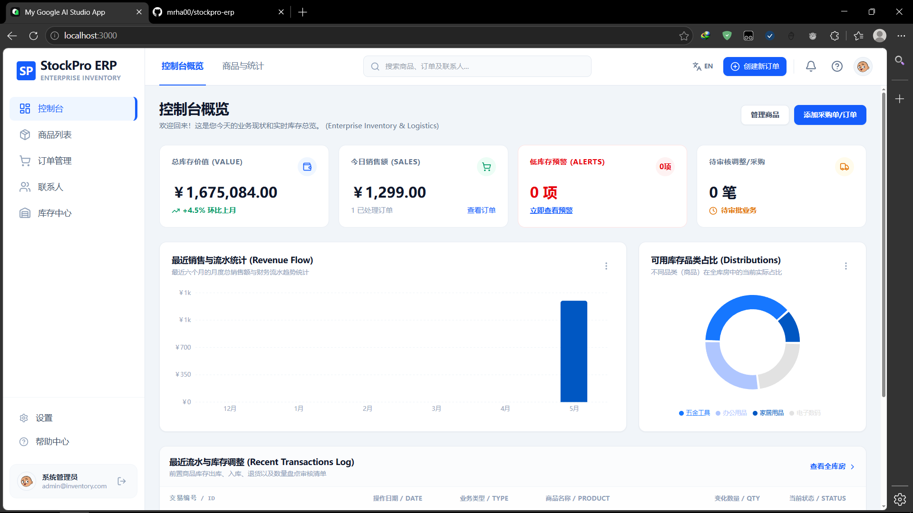
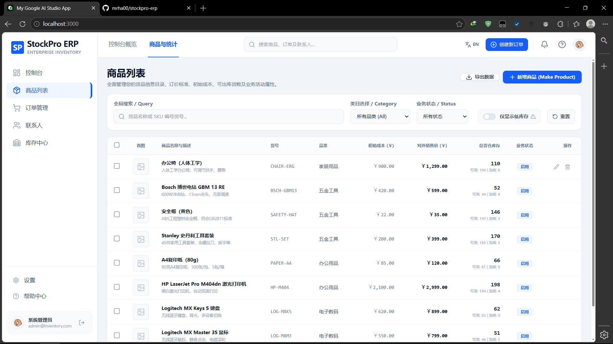
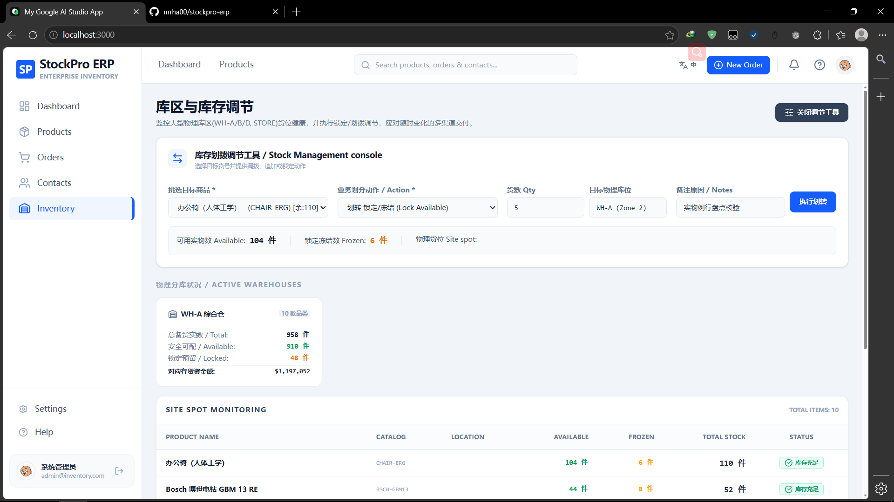
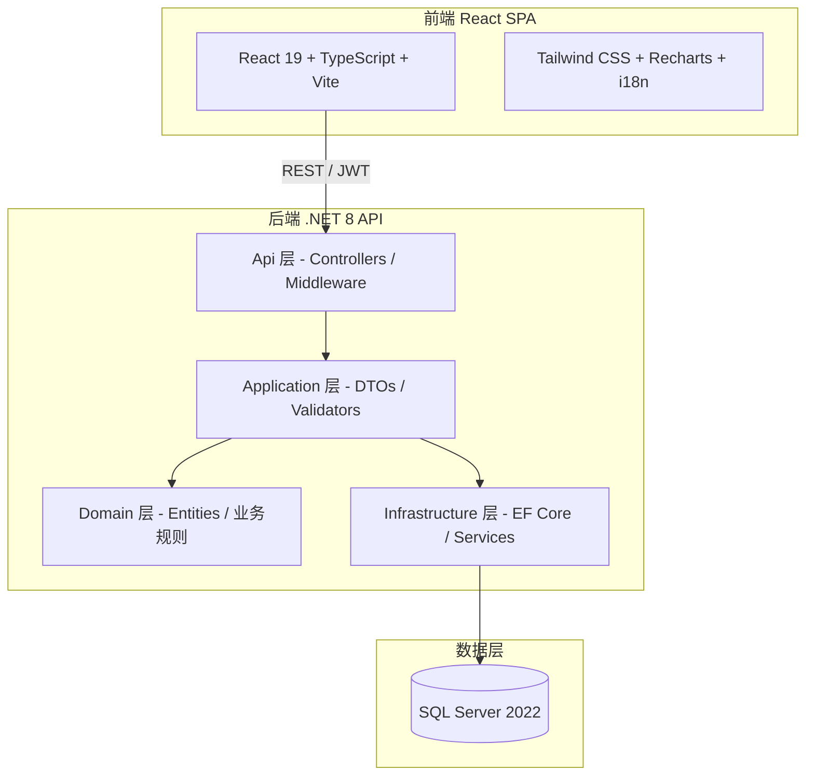

# StockPro 进销存管理系统

[](https://dotnet.microsoft.com/)
[](https://react.dev/)
[](https://www.typescriptlang.org/)
[](LICENSE)
[](https://github.com/mrha00/stockpro-erp/actions/workflows/ci.yml)

一个基于 .NET 8 和 React 19 的全栈企业级进销存管理系统，采用 DDD 分层架构，适用于简历展示与技术面试演示。

## ✨ 项目特性

- 🔐 **JWT 双令牌认证** + RBAC 权限控制
- 📦 **完整进销存流程**（商品 / 订单 / 库存 / 客户 / 供应商）
- 🗑️ **软删除 + 审计日志**，支持数据追溯
- 📊 **实时库存监控**与低库存预警
- 📈 **销售数据可视化**报表
- 🌐 **中英文国际化**
- 🐳 **Docker Compose** 一键启动
- 🔄 **GitHub Actions** 自动化构建与测试

## 📸 界面预览

| 控制台 | 商品管理 | 库存中心 |
|:------:|:--------:|:--------:|
|  |  |  |

## 🏗️ 系统架构



## 🛠️ 技术栈

| 层级 | 技术 |
|------|------|
| 后端 | .NET 8、ASP.NET Core、EF Core、JWT、Serilog、FluentValidation、BCrypt |
| 前端 | React 19、TypeScript、Vite、Tailwind CSS、Recharts |
| 数据 | SQL Server 2022 |
| DevOps | Docker、GitHub Actions、Nginx |

## 📁 项目结构

```
.
├── InventorySystem/              # 后端 DDD 四层
│   ├── src/
│   │   ├── InventorySystem.Api/
│   │   ├── InventorySystem.Application/
│   │   ├── InventorySystem.Domain/
│   │   └── InventorySystem.Infrastructure/
│   ├── tests/InventorySystem.UnitTests/
│   └── docs/                     # API 文档、上线指南、简历清单等
├── stockpro-erp/                 # 前端 React 应用
└── docker-compose.yml
```

## 🚀 快速开始

### 前置条件

- [.NET 8 SDK](https://dotnet.microsoft.com/download/dotnet/8.0)
- [Node.js 20+](https://nodejs.org/)
- SQL Server 2022 或 Docker

### 方式一：Docker Compose（推荐）

```bash
git clone https://github.com/mrha00/stockpro-erp.git
cd stockpro-erp

docker-compose up -d
```

| 服务 | 地址 |
|------|------|
| 前端 | http://localhost:3000 |
| API | http://localhost:5251 |
| Swagger | http://localhost:5251/swagger（Development） |

首次启动会自动迁移数据库并写入演示种子数据。

### 方式二：本地开发

```bash
# 1. 数据库
docker-compose up sqlserver -d

# 2. 复制本地配置（勿提交）
cp InventorySystem/src/InventorySystem.Api/appsettings.Local.json.example \
   InventorySystem/src/InventorySystem.Api/appsettings.Local.json
# 编辑其中的数据库密码与 JWT Secret

# 3. 后端
cd InventorySystem
dotnet run --project src/InventorySystem.Api

# 4. 前端（新终端）
cd stockpro-erp
npm install
npm run dev
```

开发环境默认 `SeedData:Enabled=true`（见 `appsettings.Development.json`），首次启动写入演示数据。

### 演示账号

| 角色 | 用户名 | 密码 |
|------|--------|------|
| 管理员 | admin | 123456 |
| 采购员 | purchase | 123456 |
| 销售员 | sale | 123456 |
| 仓管员 | stock | 123456 |

## 📚 文档

- [API 接口文档](InventorySystem/docs/API文档.md)
- [生产上线指南](InventorySystem/docs/生产上线指南.md)（面试可参考，简历项目不必全量实施）
- [简历就绪检查清单](InventorySystem/docs/简历就绪检查清单.md)
- [简历项目完善流程](InventorySystem/docs/StockPro简历项目完善流程.md)

## 🧪 测试

```bash
# 后端
cd InventorySystem
dotnet test

# 前端
cd stockpro-erp
npm run test
npm run build
```

## 🔧 配置说明

### 本地敏感配置

在 `InventorySystem/src/InventorySystem.Api/` 下创建 `appsettings.Local.json`（已在 `.gitignore` 中忽略）：

```json
{
  "ConnectionStrings": {
    "DefaultConnection": "Server=localhost;Database=InventorySystem;User Id=sa;Password=YourPassword;TrustServerCertificate=True"
  },
  "Jwt": {
    "Secret": "YourSecureJwtSecretKeyMustBeAtLeast32CharactersLong!"
  }
}
```

### 种子数据开关

```json
{
  "SeedData": {
    "Enabled": true
  }
}
```

仅在需要重新灌入演示数据时开启；生产环境保持 `false`。

## 📦 核心功能

- 认证授权：JWT 双令牌、RBAC、BCrypt
- 商品 / 分类管理
- 销售单 / 采购单与状态流转
- 库存入库、出库、冻结与交易追溯
- 客户 / 供应商管理
- 仪表盘 KPI 与图表

## 📄 许可证

[MIT License](LICENSE)

## 👨‍💻 作者

[mrha00](https://github.com/mrha00)

---

⭐ 如果这个项目对你有帮助，欢迎 Star！
